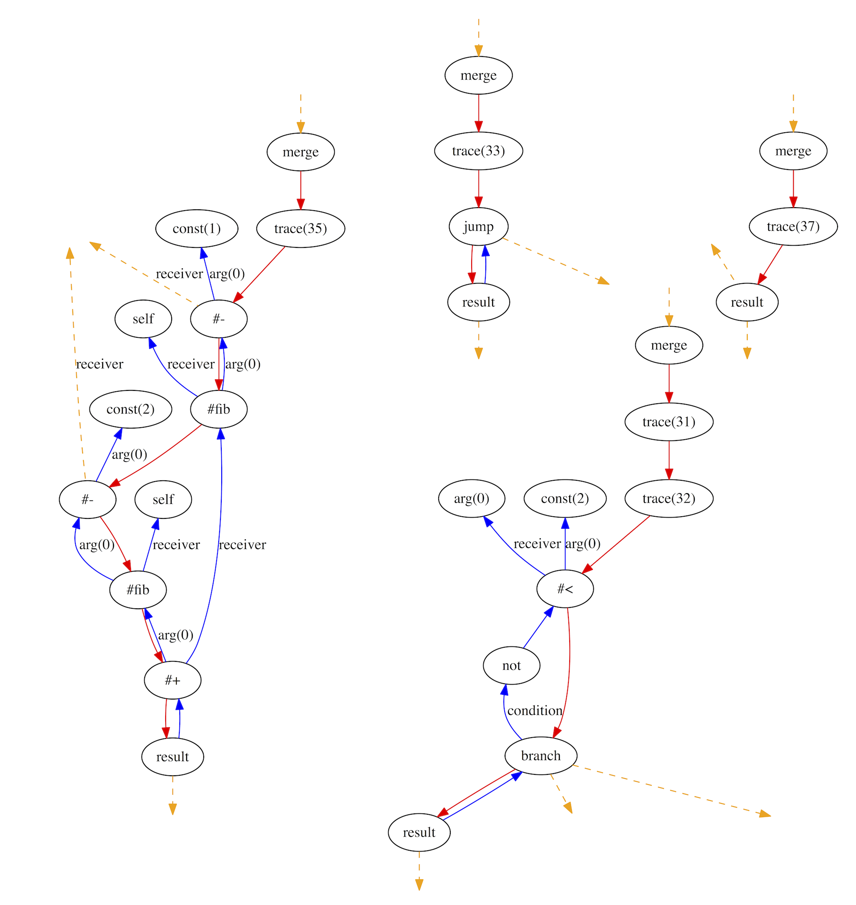
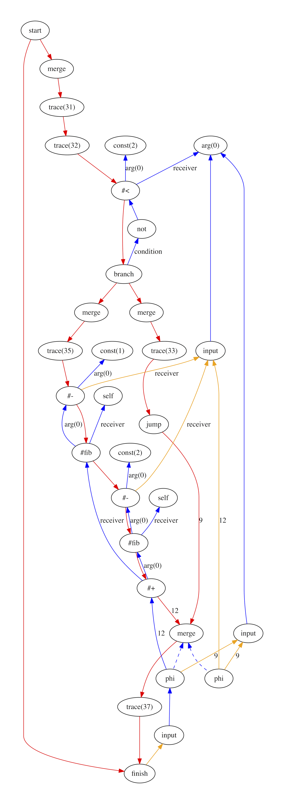

# RubyJIT

## Graph construction

Graph construction is the process of going from the RubyJIT bytecode to the
RubyJIT graph intermediate representation so that optimisations can be applied
and the program converted to machine code.

### Why we need it

We've described why we want a bytecode format - it's the universal input format
from the Ruby parsers - and we've described why we want a graph intermediate
representation - it's a more explicit but also more relaxed format for
manipulating the program. The construction process is just the way we go from
the bytecode to the graph.

### How it works

We'll use this simple `fib` function as a working example for graph illustrating
construction:

```ruby
def fib(n)
  if n < 2
    n
  else
    fib(n - 1) + fib(n - 2)
  end
end
```

We have this program represented in the RubyJIT bytecode format:

```
 0  arg      0
 1  store    :n
 2  trace    31
 3  trace    32
 4  load     :n
 5  push     2
 6  send     :<     1
 7  not        
 8  branch   12
 9  trace    33
10  load     :n
11  jump     24
12  trace    35
13  self       
14  load     :n
15  push     1
16  send     :-     1
17  send     :fib   1
18  self       
19  load     :n
20  push     2
21  send     :-     1
22  send     :fib   1
23  send     :+     1
24  trace    37
25  return
```

What we need to do is to turn this into a graph.

At this point we're going to start to point out some interesting parallels that
you get in the implementation of a compiler. The first one is that having parsed
the Ruby source code to this bytecode (or actually we used the underlying Ruby
implementation to do that for us), we are now effectively going to do this
again, and now parse the bytecode into a graph. By dividing up the parsing into
two stages like this, each stage is simpler for us to understand, program and
test. We'll also re-use the bytecode and the interpreter again for another task
in the future.

#### Finding basic blocks

A basic block is a useful way to continue to simplify how we can think about the
program. At the moment we have one big, contiguous, sequence of instructions,
with jumps and branches around within it. The jumps and branches are the most
complex bit of that. We can simplify this by breaking the bytecode into chunks
where within each chunk there are no jumps or branches, and the jumps and
branches are now from one chunk to another, rather than just from one
instruction to another. We call these chunks 'basic blocks'.

There are four basic blocks in our bytecode. We can name them using the index
of their first instruction:

###### Basic block 0

```
 0  arg      0
 1  store    :n
 2  trace    31
 3  trace    32
 4  load     :n
 5  push     2
 6  send     :<     1
 7  not        
 8  branch   12
```

###### Basic block 9

```
 9  trace    33
10  load     :n
11  jump     24
```

###### Basic block 12

```
12  trace    35
13  self       
14  load     :n
15  push     1
16  send     :-     1
17  send     :fib   1
18  self       
19  load     :n
20  push     2
21  send     :-     1
22  send     :fib   1
23  send     :+     1
```

###### Basic block 24

```
24  trace    37
25  return
```

Now the code in each basic block is simpler - it's linear.

To find basic blocks we need to find all the instructions which are the target
of a jump or a branch. Branches are conditional, so we also consider the
instruction that follows a branch instruction to be a target. They are like the
`else` case of the branch.

It's a bit like we've created subroutines from our method. This is another one
of those interesting parallels.

#### Converting basic blocks to a graph fragment

Now that we have all the basic blocks, let's create a fragment of a graph for
the instructions in each basic block. This is a simpler problem to start with,
because the instructions in each basic block are linear, without any jumps or
branches.

The technique we use to do this is a form of *abstract interpretation*. We're
going to run the instructions in the basic block, but instead of passing around
real values and performing real computations, we are going to pass around
objects that represent that a value would be available if we were actually
running the program, and graph nodes are created whenever we encounter a
computation. It's similar to promises or futures in concurrent programming. This
is one of the most interesting parallels for us - the code for converting a
basic block to a graph is almost the same as the code for running the
instructions in the interpreter!

Compare the code for the `not` instruction in the interpreter:

```ruby
when :not
  stack.push !stack.pop
```

With the code in the graph fragment builder for the same instruction:

```ruby
when :not
  value_node = pop.call
  not_node = Node.new(:not)
  value_node.output_to :value, not_node
  stack.push not_node
```

The interpreter has a stack of actual runtime values. To interpret the `not`
instruction it pops one value, uses `!` to perform the actual negation, and then
pushes the result value.

When the graph builder pops a value off the stack, it gets a node that
represents the value that will be the input when the program is run. It creates
a new node that is a negation operation, and sends the value it got off the
stack as an input to the new node. It then pushes the new node back onto the
stack. It is the same set of steps, but completed with abstract values instead
of real values.

As we only build one basic block at a time, the basic block may depend on values
that we don't have, such as values on the stack or local variable names. In the
graph builder, at this stage, we represent these as special `input` nodes and
will connect them up later.

The graph fragments of our basic blocks look like this, with the dangling edges
show in orange:



#### Combining graph fragments into a graph

Now that we have a graph fragment for each basic block, with dangling edges for
values that the fragment needs and the fragment produces, we need to connect up
the fragments and the dangling edges.

Each basic block has a single control flow path through it, so connecting the
control flow between basic blocks is fairly easy and we just need to add a new
control flow edge from the previous fragment's jump or branch node to the
current fragment's merge node.

Connecting the data flow is a little more complicated. The fragments have edges
coming in that say that they need a name that has been defined somewhere else,
or a stack value that should have been pushed somewhere else, and they have
edges coming out that say that they have defined a name or pushed a stack value.
We need to connect all those edges up to something.

The first thing we do is make a transitive set of those edges for each fragment.
This means for each basic block we want to know not just the edges that it
produces, but also any edges produced by preceding basic blocks. This is because
a name that a fragment may need may not be defined in just the previous block,
but in blocks previous to that one. Creating the transitive set means that we
have all names and stack values defined coming out of a basic block.

A block may have more than one preceding blocks though - for example code after
an `if-else` that is executed without depending on which branch of the `if` was
taken. A name could have been set to different values in the two branches. When
a block has two or more preceding blocks we create a phi node for each name and
stack value. The switch value of the phi node just points at the merge node of
the basic block.

The connected graph fragments looks like this:



#### The post-build pass

After constructing the graph we are left with some scaffolding. We create phi
nodes for all names, even if it turned out that they weren't used, and we have
these input nodes that always have one edge coming in and one edge coming out so
they aren't really useful for anything anymore.

After constructing the graph we run some optimisation passes to tidy the graph
up. We'll describe optimisation passes in more depth later, but they are
operations applied to the graph to improve it in some way. Our post-build
optimisation passes include a pass to remove the useless input nodes, and jump
nodes which also now have no purpose because they just one control flow edge to
another.

After that we run passes to remove dead code, to get rid of the phi nodes that
nobody is using. And finally we run a pass to remove phi nodes that don't
actually give any choice because all inputs point at the same node. These were
introduced if a block had more than one previous blocks but the values from each
block were actually the same.

As we say, we will explain how these optimisation passes work later on.

This is the final graph after post processing:


### More technical details

We struggled to find much technical description of how to build a sea-of-nodes
graph at all. Abstract interpretation seems to be the way everyone does it, but
we coulnd't find more specifics written down particularly about joining the
basic blocks together.

### Potential projects

* Adding useless nodes and then removing them is wasteful, so it is possible to
  avoid creating the input and jump nodes which are remove straight after
  construction, and is it possible to not create phis which are immediately
  dead?
* Discover the formal algorithms for graph construction and apply and write them
  up properly.
