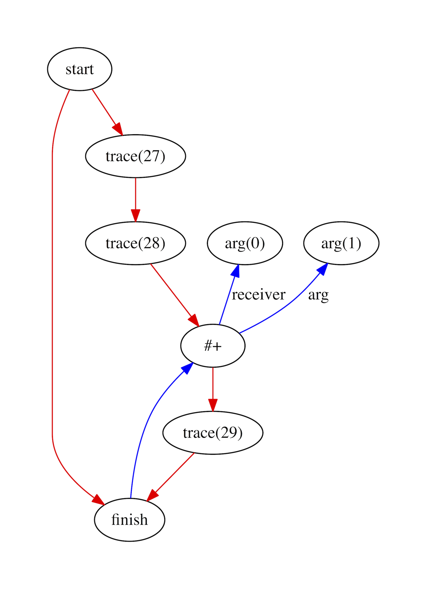
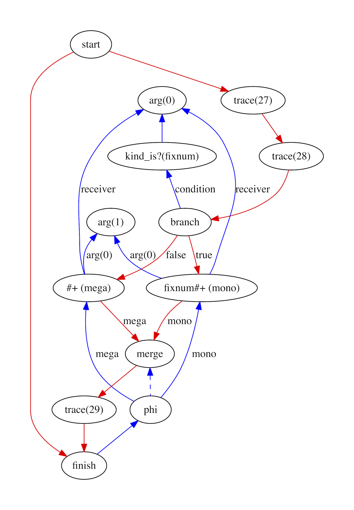
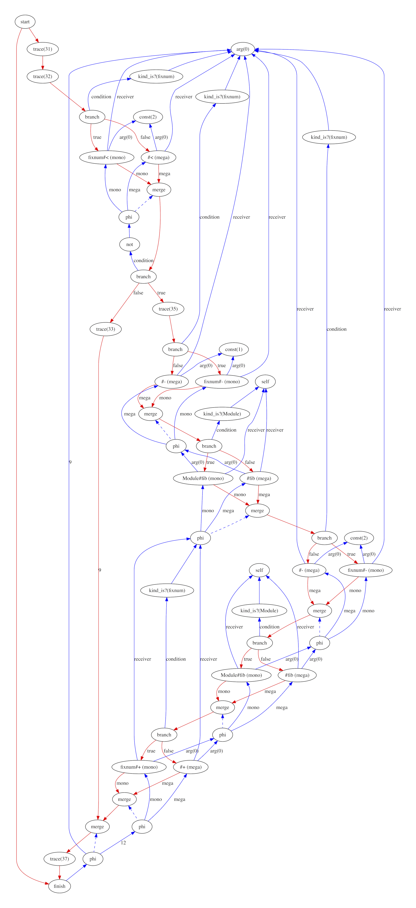

# RubyJIT

## Inline caching

Inline caching is one of the key fundamental optimisations for a programming
language like Ruby. When it can be applied, it removes the overhead of looking
up which method to call for a given object and method name by caching it. The
cache is called 'inline' because it's part of the structure of the program
itself, not a separate data structure.

RubyJIT implements simple monomoprhic inline caching based on profile
information collected by the interpreter.

### Why we need it

Apart from module and method definitions and some control flow structures, a
Ruby program is almost nothing but method calls. Even most operators are just
method calls. Conceptually, making a method call in Ruby involves looking up the
correct method to run based on the name written in the source code and the class
of the receiver object. Compared to machine operations such as adding numbers
together, this is an extremely slow operation. If we did it for each method call
it would likely completely dominate the execution time of the program.

The simplest solution for this problem is to cache the method lookup operation.
We could have a hash data structure of a pair of the receiver class and the
method name, to the method to call. We'd still be doing a lookup in this hash
though.

A more sophisticated solution is to create a cache in the structure of the program itself. Consider an expression that adds together two numbers:

```ruby
a + b
```

A simple monomoprhic inline cache line the one we are going to build has the
method to call hardcoded into the program, and checks that this method is the
correct one to call by quickly checking the class of the receiver object. We
call this a *guard*. If the class is the expected one, it calls the right cached
directly. If the class wasn't the expected one we then do a full method lookup
and call the right method.

```ruby
if a.is_a?(fixnum)
  fixnum_add(a, b)
else
  lookup_method(a, :+).call(b)
end
```

### How it works

The inline caching optimisation pass looks for send nodes which have profiling
information gathered by the profiler and that have been called with only a
single kind of receiver.

It replaces them with two sends - the one specialised for the method call we are
caching, which we call the *monomorphic* one, and one like the original send
which can handle any receiver kinds, which we call the *megamorphic* one. A
`is_kind?` node compares the kind of receiver against what we expect, and then a
branch directs control flow to monomorphic send if the kind is expected, and if
not to the megamophic send. A merge node and a phi merges the control flow and
the return value from the two sends.

Consider a simple add function that contains a single send, in an `+` operator,
and that has only been called with `Fixnum` values.

```ruby
def add(a, b)
  a + b
end
```

The graph before contains the single `send` node.



After the inline cache pass has run there are now the two `send` nodes and a
diamond control flow structure which branches between the two based on the
`kind_is?` node, which is our guard.



The program still works in exactly the same way as before, but it should
hopefully run in less time if the cache works and `a` is the kind that we
expect.

However, the graph is more complicated now. Before we had a linear control flow
path and now it branches. For a more complicated method it can really add some
complexity. It's not just the diamond branch between the two sends, it's also
the guard nodes. In this case we generate a lot of redundant guards - notice
that we check the kind of the first argument three times when it could be done
just once and result used multiple times. We'll remove this redundant work in
later optimisations. This is an example of where the code is simpler in this
pass by relying on another pass to tidy up later.



We'll talk about other problems - and actually some new opportunities - caused
by this extra complexity when we talk about deoptimisation later.

#### What happens if the cache is wrong?

In the examples above we've compiled in both a monomorphic send for when the
cache hits, and a megamorphic send that is able to handle any receiver kinds for
when the cache misses. However if the cache misses a lot we'd probably prefer to
change the program instead of just using the slower send.

When we talk about deoptimisation later we'll discuss what else could go on the
cache miss side of the branch.

#### Expanding to polymorphic caches

Our inline cache handles just a single kind of receiver and only have a slow and
a fast path. Inline caches can be expanded to deal with an arbitrary number of
kinds of receiver, with a chain of guards that check for multiple expected
receiver kinds and have monomorphic sends for the cached methods for them. This
is called a polymorphic inline cache.

There are then lots of questions about what order to put the guards for the
kinds in and how many to have. In RubyJIT we only have monomorphic inline
caches.

### More technical details

The idea for [inline-caching](inline caching) comes from the Smalltalk language
and the work of Peter Deutsch and Allan Schiffman. Smalltalk is one of the
languages the inspired Ruby, and in some ways it is even more extreme in making
everything that it can a method call so they needed to develop inline caching to
make performance reasonable.

[inline-caching]: 
http://web.cs.ucla.edu/~palsberg/course/cs232/papers/DeutschSchiffman-popl84.pdf

An inline cache was originally described as being a snippet of machine code that
does both the profiling and then the inline caching itself, storing the cache
information as data alongside the instructions and updating it when the cache
misses so it always has the last method all cached.

In RubyJIT the inline cache is instead a structure created in the compiler
graph, pretty much as if the user wrote it out in Ruby. The advantage of is that
this means that the nodes created can then manipulated by later optimisation
passes. For example, multiple guards that check the same thing can be combined
by the same optimisation passes that do this for user code.

[polymorphic-inline-caching](Polymorphic inline caching) extends inline caching
to have more than one method cached at each location, and was developed by Urs
Hölzle, Craig Chambers and David Ungar.

[polymorphic-inline-caching]: 
http://www.selflanguage.org/_static/published/pics.pdf

Stefan Marr, Chris Seaton and Stéphane Ducasse further extended inline caches to
deal with multiple method names in a technique called
[dispatch-chains](dispatch-chains). This is relevant to Ruby, where the method
name can be varied dynamically by using a call to `Kernel#send` which takes the
method name as a parameter.

[dispatch-chains]: 
http://chrisseaton.com/rubytruffle/pldi15-metaprogramming/pldi15-marr-et-al-zero-overhead-metaprogramming.pdf

### Potential projects

* Add polymorphic caching.
* Use dispatch chains for caching calls via `Kernl#send`.
