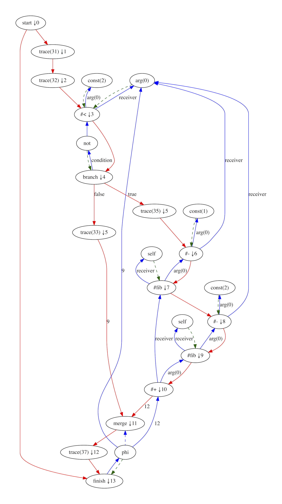
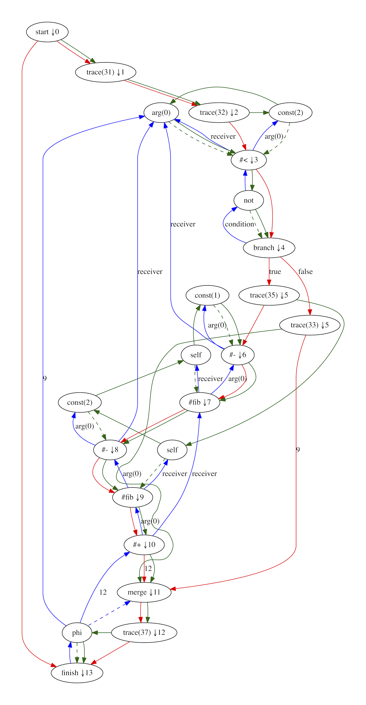

# RhizomeRuby

## Scheduler

The Rhizome scheduler decides what order to run your program. You may think that
programs already have an order - the order in which they are written, but really
there are many orders we could run your program and still provide the same
result. The scheduler picks one order for you - hopefully one that is efficient.

### Why we need it

When we convert Ruby code into our intermediate representation, we take the
rules about the order in which parts of a Ruby method need to run and make them
explicit. If there isn't a rule about how something has to be ordered, we relax
the ordering, because this allows us more freedom when optimising.

Our intermediate representation allows this because it is a graph rather than
just a linear list of instructions, and this means that something like a diamond
shape can represent that we want an instruction to run after one of two other
instructions, but we don't care which of those instructions is run before the
other. Another way of saying this is that the graph only has a partial ordering.

The machine code that we want to emit at the end of compilation is linear - it
has a total order and each instruction needs to happen after exactly one
instruction and before exactly one other instruction.

### How it works

The scheduler is a kind of topological sort, which means taking a graph and
finding a path through it where we are following the flow of data and control,
so that nodes do not appear until all the inputs are ready and do not appear
before nodes that need to come after them.

The scheduler is implemented in three phases - annotating the graph with a
partial ordering, then global and then local scheduling. All these phases add
new information to the graph - existing edges aren't modified and there's no
other output objects.

The scheduler is heuristic, which means it gives a valid but not always the best
schedule. There are usually many valid schedules and we try to pick a good one.
It may not be clear how to pick the best one at all, if we really wanted to
consider the huge complexities of a modern processor.

#### Partial ordering

The first thing the scheduler does is annotate all the fixed nodes - these are
nodes which already have to happen in some order because they potentially have
side effects - with a number that you can use to easily compare if one node must
come before another. This will be useful later on.

We say that this ordering is partial because it doesn't give us an order between
two nodes on different branches - it's not called partial because it doesn't
apply to the nodes which have no control-flow and are still floating.

We begin at the start node, number it `0`, and then we annotate all the fixed
nodes that follow it in control flow with `1`, and continue from there. When we
reach a merge node it could possibly follow two or more nodes with different
numbers. We number it with one more than the maximum of the numbers of the
previous nodes, so that the numbers always go up as you follow the control flow
of the program.

We'll use this simple `fib` function as a working example:

```ruby
def fib(n)
  if n < 2
    n
  else
    fib(n - 1) + fib(n - 2)
  end
end
```

The partial ordering phase annotates the fixed nodes - those with red
control-flow edges, with a number after a little downward arrow. You can see
that if you follow the red edges, the number always goes up. You can see if one
node needs to come before another by comparing the numbers:


#### Global scheduling

The next step is to globally schedule the graph. Global in this case means that
we're thinking about the whole method at the same time.

We want to take all the floating nodes - the nodes which aren't tied down into
any particular part of the method - and fix them to happen in one particular
basic block, in one particular part of the program.

These are the major decisions of scheduling and different choices can have a big
impact on performance. If we have a big, expensive computation that is only
needed on one branch of an if-statement, then it's more efficient to schedule
that computation to only happen in that branch, rather than before the
if-statement where it's also run if we take the other branch.

Our global scheduling policy is to schedule as late as we can while still having
each piece of code appear just once. This means that for each floating node,
which pick that latest node that has a control-flow path to all the users of the
node. We look at all nodes in the graph, and see if there is such a path. We
then sort these candidates by their partial ordering number, and pick the latest
one - the one with the highest number.

Scheduling as late as possible isn't necessarily always a good idea. For
example, it may make sense to schedule code to run earlier than you need it, if
for example you know that the processor has logic that would otherwise be idle
at that point. Making a decision like that requires extremely sophisticated
knowledge of the processor you want to run on, so we don't attempt anything like
that.

We could also possibly make better schedule decisions if we could split code.
This means to duplicate nodes so that multiple users can have their own copies
scheduled differently. Consider a three-branch if-statement, where two branches
use an expensive computation, but the other does not. We'd schedule that before
the entire if-statement, as that's the only place where control flows to both
the branches that need it, but it also runs it for the branch that doesn't need
it. If you created two copies of the expensive computation you could move each
into a branch. This would increase code size however.

After global scheduling the nodes which were floating - those with no red
control-flow edges - now have a new dark green dashed arrow that anchors them to
some other node, which is fixed.



#### Local scheduling

Finally, we locally schedule the graph. Local in this case means that we're
thinking about one basic block at a time. After global scheduling, all the
previously floating nodes are now anchored to a node that's part of a basic
block, but within each basic block we've still got a graph of nodes that could
be run in multiple orders.

Inside a basic block there is no branching, so we will always have to execute
all the instructions and the order doesn't matter as much, as long as we have
always executed the inputs a node needs before executing it.

Our local scheduling policy is to schedule early - as soon as all inputs to a
node needs are ready. We go through each node in the basic block, and if all the
inputs have been locally scheduled, we then locally schedule that node,
continuing to go through the nodes in the block until they're all locally
scheduled.

We schedule locally early, but globally late, because locally we know we'll
eventually need everything and want to give the processor a chance to get
started on it as soon as possible, where globally we may or may not need results
from computation so don't want to start them until we know we'll need them.

After local scheduling all nodes now have a new, solid, dark green edge. Within
each basic block this line traces a single linear order in which to execute all
the nodes. This is the order in which your program will be run. The graph is now
quite hard to read, with a lot of information in these edges:



#### Linearization

The scheduler is also responsible for linearization of the graph, although this
operation is usually run later, after phases described in other documents.
Linearization takes the a scheduled graph and produces a linear sequence of
instructions. It's like the opposite of graph building.

Linearization does the work of understanding how the graph has been scheduled
and produces a simple list of instructions that the assembler can use to produce
machine code.

For the graphs above, the result of linearization is a sequence of instructions.
Branch and merge nodes have been transformed to fit the linear format, becoming
`jump` instructions for unconditional jumps, and `branch_if` and `branch_unless`
instructions for conditional branches with fallthrough based on the order in
which the basic blocks have been linearized.

Basic blocks are linearized in the order in which they are found when traversing
the graph depth-first, except that the block with the `start` node always comes
first and the block with the `finish` node always comes last. `finish` is
renamed `return` to represent the change from the declarative representation of
the graph to the imperative one of a list of instructions.

```
  trace 31
  trace 32
  constant r0 2
  arg r1 0
  send r12 r1 < r0
  not r13 r12
  branch_if r13 2
block1:
  trace 33
  jump 3
block2:
  trace 35
  self r3
  constant r4 2
  self r5
  constant r6 1
  send r7 r1 - r6
  send r8 r5 fib r7
  send r11 r1 - r4
  send r10 r3 fib r11
  send r9 r8 + r10
block3:
  trace 37
  phi r2 block2 r9 block1 r1
  return r2
```

In this example we're still showing the high level operations such as `send` and
`phi` operations. The normal use of the linearizer is to lower to machine-level
operations before linearization.

### More technical details

Less seems to be written about scheduling than even the rest of compilers. We
think this may be partially because sea-of-nodes is a less traditional approach
and scheduling is simpler when you already have basic blocks and you only need
to do the local phase. The sea-of-nodes approach deliberately relaxes
constraints on the order of the program in order to optimise more freely, but
then we have to go back and do more work to reconstruct an order from less
information.

This is another example of how a compiler throws away information and then
recreates it, as the linear source code goes through the graph IR and then back
into the linear machine code.

Our scheduler is a topological sort that schedules late globally but early
locally. We're not sure if there is any way more specific or technical to
describe it than that, and couldn't find much description of the schedulers in
any compilers.

### Potential projects

* Implement splitting to allow expensive computations to be scheduled later
  when they are used on more than one but not all branches.
* Make a better decision about the order to emit basic blocks in the
  linearizer. At the moment it is just as they are found when traversing the
  graph depth-first. Processors normally predict forward branches to be not
  taken if they have no other information, so we should try to match that
  expectation.
